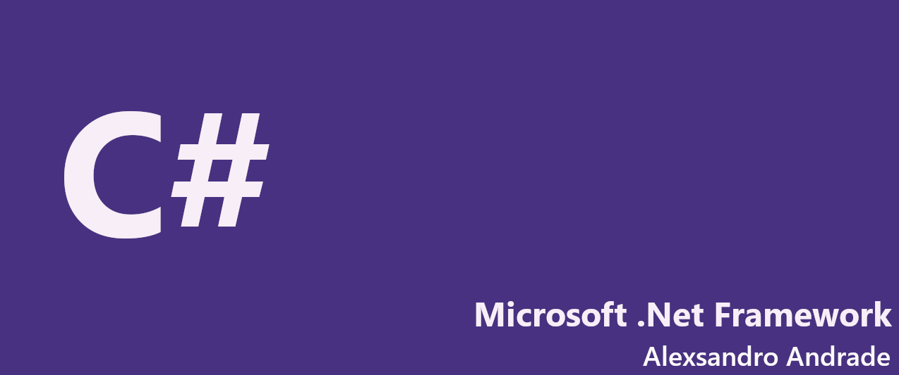

      

  

# Trabalhando com Interfaces na linguagem C#

Projeto criado para mostrar como é possível trabalhar com Interfaces melhorando todo nosso código escrito.

<h2><strong>Tecnologias usadas</strong></h2>

- WSL v1.0
- Ubuntu v18.04
- Python v3.8.2
- Visual Studio Code v1.44

<h2><strong>Técnicas usadas</strong></h2>

- Interfaces (OOP)
